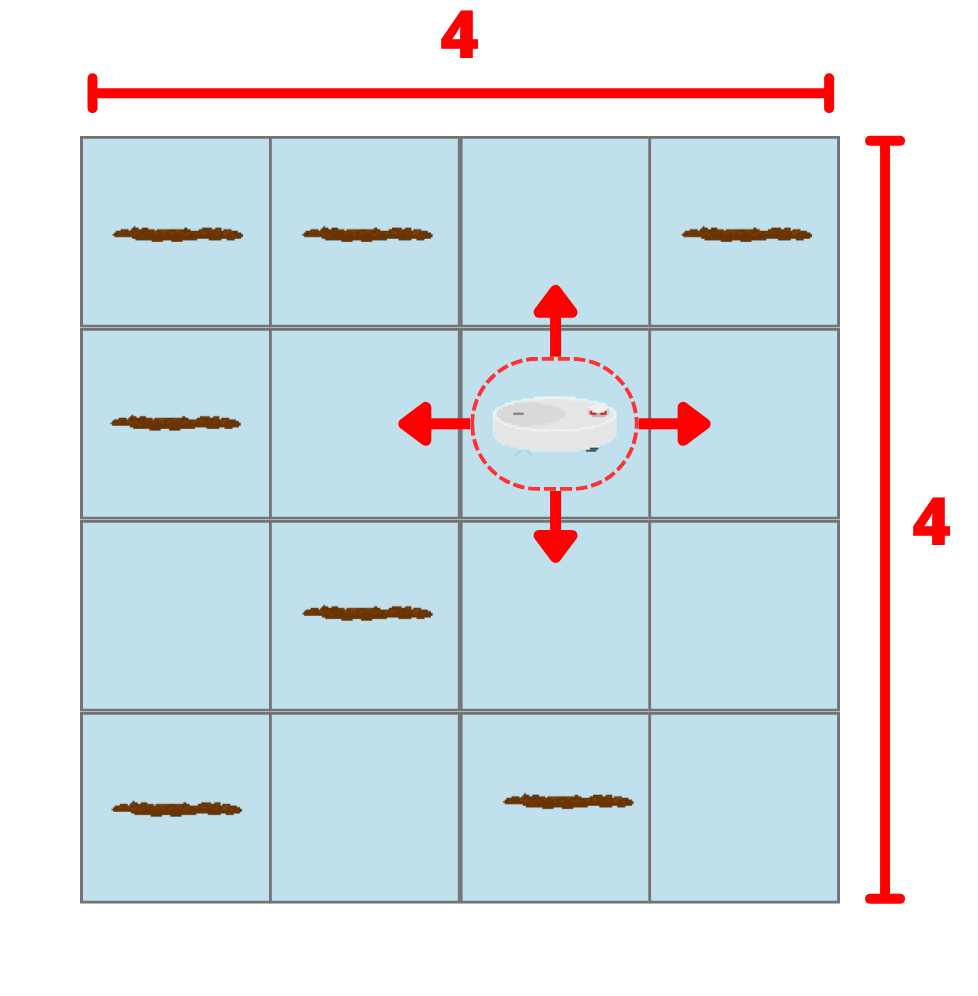
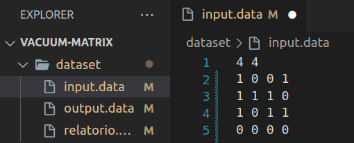
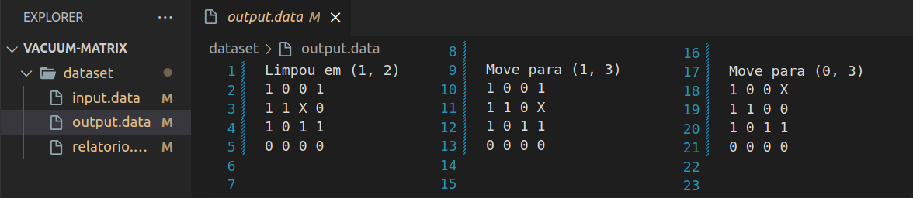
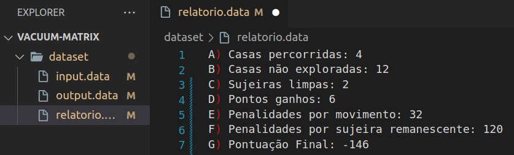

  
  
  

 
<!-- <h1 align="center">
    
</h1> -->

## 🗂️ Estrutura do Repositório

- `article/`: Diretório contendo o relatório em formato LaTeX.
- `src/`: Diretório com os scripts C++ usados para gerar os percursos do agente e realizar as análises.
- `dataset/`: Diretório com os conjuntos de `output.data` e `relatório.data` gerados nas exṕlorações.
- `imgs/`: Diretório com as imagens utilizadas no relatório.

## 📝 Resumo

 

<em>Figura 1: Imagem ilustrativa do funcionamento do agente reativo simples implementado. </em>

Este trabalho apresenta o desenvolvimento de um agente inteligente aspirador robô para simulação de limpeza de um ambiente matricial, utilizando C++. A aplicação permite aos usuários inserir o tamanho da matriz quadrática desejada e simular o comportamento do agente, gerando um 'output' e um 'relatório' do desempenho do agente em determinados níveis de sujeira do ambiente. Destinado a introdutórios de Inteligência Artificial, a implementação pode facilitar a visualização e compreensão dos conceitos básicos de funcionamento de um agente inteligente.

## 🔄 Compilação e Execução 

### 1. Arquivo de Entrada - 'Matriz de Percurso' (`input.data`)

É essencial que o usuário inclua um arquivo denominado `input.data`, dentre a coleção de arquivos inserida na pasta (`dataset`), contendo uma 'matriz de percurso', seguindo o seguinte formato:

 

<em>Figura 2: Imagem ilustrativa do arquivo `input.data` que deve ser inserido ou alterado. </em>

Contendo em sua primeira linha os valores `NxN` do tamanho da matriz e em seguida a matriz, onde `0` representam quadrados limpos e `1` os quadrados sujos.

### 2. Arquivos de saída (`output.data` e `relatorio.data`)

Ao final de sua execução, o programa gera um arquivo (`output.data`) dentro da pasta (`dataset`), o qual contém todo o percurso do agente ao longo de sua execuação e outro arquivo (`relatorio.data`), contendo o desempenho do agente. Certifique-se de verificá-los ao final da compilação.

 

<em>Figura 3: Imagem ilustrativa do arquivo `output.data` gerado após a compilação do programa. </em>

 

<em>Figura 4: Imagem ilustrativa do arquivo `relatorio.data` gerado após a compilação do programa. </em>

### 3. Execução

Por fim, esse programa possui um arquivo (`Makefile`) e um (`CMakeLists`), os quais realizam todo o procedimento de compilação e execução. Para tanto, cabe ao usuário escolher o de sua preferência, porém se atente ao fato de que para cada um temos as seguintes diretrizes de execução:

#### Makefile

<table align="center">
  <tr>
    <th>Comando</th>
    <th>Função</th>
  </tr>
  <tr>
    <td>make clean</td>
    <td>Apaga a última compilação realizada contida na pasta build</td>
  </tr>
  <tr>
    <td>make</td>
    <td>Executa a compilação do programa utilizando o gcc, e o resultado vai para a pasta build</td>
  </tr>
  <tr>
    <td>make run</td>
    <td>Executa o programa da pasta build após a realização da compilação</td>
  </tr>
</table>
	
#### CMake

<table align="center">
  <tr>
    <th>Comando</th>
    <th>Função</th>
  </tr>
  <tr>
    <td>cmake -B ./build</td>
    <td>Cria as instâncias da pasta build necessárias para execução do programa</td>
  </tr>
  <tr>
    <td>cmake --build ./build</td>
    <td>Executa a compilação do programa utilizando o cmake, e o resultado vai para a pasta build</td>
  </tr>
  <tr>
    <td>./build/app</td>
    <td>Executa o programa da pasta build após a realização da compilação</td>
  </tr>
</table>

# 📞 Contato

<table align="center">
  <tr>
    <th>Participante</th>
    <th>Contato</th>
  </tr>
  <tr>
    <td>Celso</td>
    <td><a href="https://t.me/celso_vsf"> </td>
  </tr>
</table>